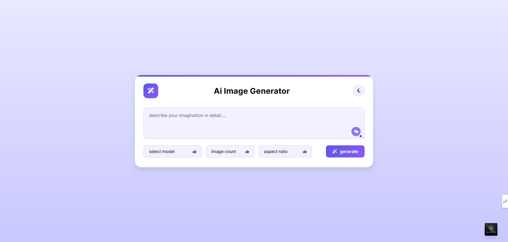
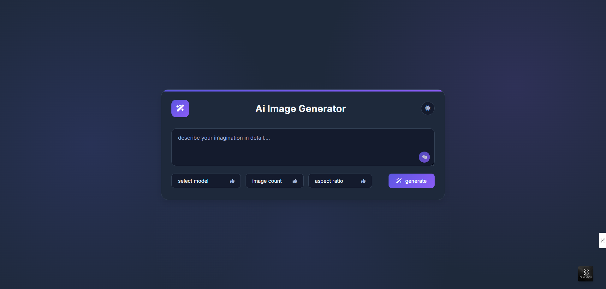
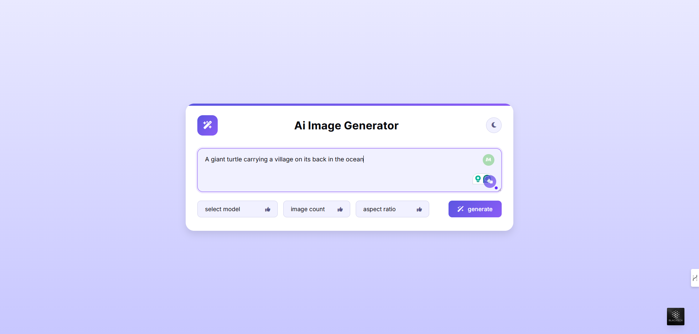
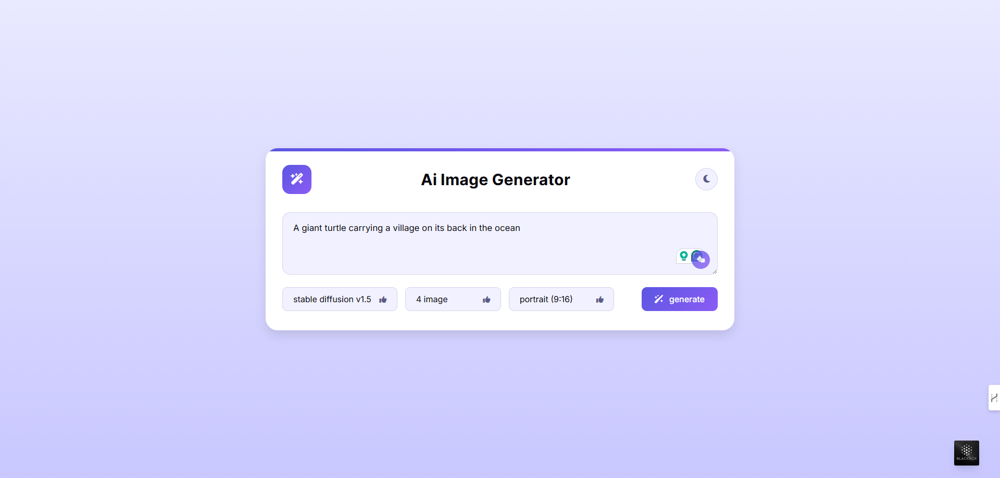
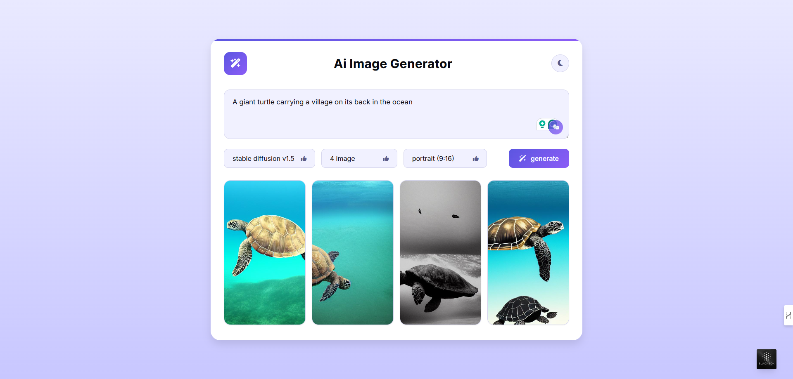

## AI Image Generator Application

A beautiful, elegant, and well-structured AI image generator application to unleash you creativity or imaginary through prompt-text to realistic art generation.

## Overview

This project is a modern web application that leverages the power of the Hugging Face AI API to generate images based on user input. Designed with elegance and usability in mind, the application features a clean and responsive interface.
## Technologies Used

- HTML
- CSS
- JavaScript (No Additional Dependencies)
- Hugging Face AI API


## Features

- **AI Models:** Use different types of AI LLM versions such as flux.1-dev, flux.1-schnell, stable diffusion xl, stable diffusion 3, and stable diffusion 1.5.
- **Image Size:** Select 3 types of image sizes such as square, landscape, and portrait.
- **Real-time Image Generation:** Generate high-quality images instantly using state-of-the-art AI.
- **Customizable Input:** Allow users to customize image generation parameters.
- **Theme Switcher:** Light and dark mode toggle theme switching.
## Installation

Follow these steps to set up the project locally:

 1. **Clone the Repository:**

```bash
git clone https://github.com/minhazhalim/AI-Image-Generator-Application.git
```
2. **Navigate to the Project Directory:**

```bash
cd AI-Image-Generator-Application
```
3. **Open the Project Folder:**

    Open ```index.html``` file in your preferred web browser.


## Usage

1. **Enter Your Prompt:**

- Type the description or keywords for the image you want to generate in the input field or you can simply click the 'Get Random Prompt' icon from bottom right corner to generate some random prompt text provided by application

2. **Generate Image:**

- Click the "Generate" button to start the image generation process. You can select 3 options such as LLM Image model provided by Hugging Face API, number of images to be displayed, and 3 different image sizes.

3. **View the Result:**

- The generated image will be displayed on the page given by selected 3 different options. You can refresh or adjust your prompt to generate new images.
## Contributing

Contributions are welcome! If you have suggestions, bug fixes, or enhancements, please follow these steps:

1. Fork the Repository.

2. Create a new branch for your feature or bug fix:
   ```bash
   git checkout -b feature/YourFeatureName
   ```
3. Commit your Changes:
   ```bash
   git commit -m "Add: Your detailed description of the feature/bug fix"
   ```
4. Push to your Branch:
   ```bash
   git push origin feature/YourFeatureName
   ```
5. Open a Pull Request with a clear description of your changes.
## Screenshots






